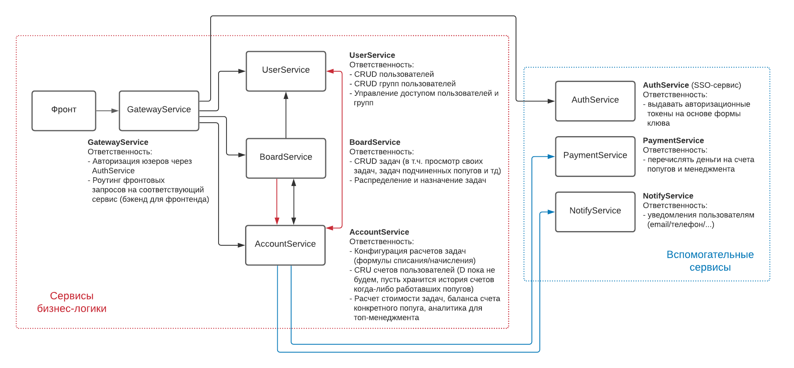

# PopugJira

* [Схема системы](https://github.com/DariaPlotnikova/popug/tree/week_0#%D1%81%D1%85%D0%B5%D0%BC%D0%B0-%D1%81%D0%B8%D1%81%D1%82%D0%B5%D0%BC%D1%8B)
* [Какие события и запросы ходят между сервисами](https://github.com/DariaPlotnikova/popug/tree/week_0#%D0%BA%D0%B0%D0%BA%D0%B8%D0%B5-%D1%81%D0%BE%D0%B1%D1%8B%D1%82%D0%B8%D1%8F-%D0%B8-%D0%B7%D0%B0%D0%BF%D1%80%D0%BE%D1%81%D1%8B-%D1%85%D0%BE%D0%B4%D1%8F%D1%82-%D0%BC%D0%B5%D0%B6%D0%B4%D1%83-%D1%81%D0%B5%D1%80%D0%B2%D0%B8%D1%81%D0%B0%D0%BC%D0%B8)
* [Возможные проблемы](https://github.com/DariaPlotnikova/popug/tree/week_0#%D0%B2%D0%BE%D0%B7%D0%BC%D0%BE%D0%B6%D0%BD%D1%8B%D0%B5-%D0%BF%D1%80%D0%BE%D0%B1%D0%BB%D0%B5%D0%BC%D1%8B)

## Схема системы

* Черные стрелки - синхронное взаимодейстие, красные - асинхронное через шину, синие - асинхронные
  через отдельный воркер, поднятый рядом с основными на той же БД.
* Асинхронное взаимодействие через шину - есть шина событий, сервис-поставщик публикует события с 
  доп.информацией (для каждого поставщика специфические события с нужной ему информацией), 
  сервисы-подписчики читают и что-то делают.
* Пока что PaymentService умеет отправлять деньги только по номеру счета, который попуг указал 
  при регистрации. Но когда-нибудь он сможет переводить и по номеру телефона, и через Я.Деньги, 
  и голубиной почтой.
* Пока что NotifyService отправляет только письма на email, но в будущем сможет писать смс и даже 
  отправлять пуши в мобильное приложение PopugJiraMobile. 

### Какие события и запросы ходят между сервисами

| Сервис | Какое событие публикует | Кто слушает такое событие | Что делает в обработке события |
| ------ | ------ | ------ | ------ |
| UserService | Пользователь создан, неактивный (user_id) | AccountService | создает счет пользователя |
| BoardService | Задача назначена (task_id, user_id, assign_time) | AccountService | сохраняет в аудит списание для user_id по этой task_id в assign_time |
| BoardService | Задача выполнена (task_id, user_is, finish_time) | AccountService | сохраняет в аудит начисление для user_id по этой task_id в finish_time |
| AccountService | Счет создан (user_id) | UserService | активирует пользователя |

Обработка каждого события в сервисе-потребителе должна перед действием проверять, не было ли уже 
выполнено такое действие, и если да - ничего не делать. Для этого в данных события должны 
содержаться ключи, позволяющие идентифицировать событие (например, task_id + user_id + assign_time).

Идентификаторы объектов - uuid.

| Сервис | Какой запрос выполняет | Какой запрос -> ответ | В какой сервис | Что делает с ответом |
| ------ | ------ | ------ | ------ | ------ |
| GatewayService | запрос за токеном пользователя| user_id: uuid, passwd: str -> token: str | AuthService | запоминает токен пользователя |
| GatewayService | запрос "как есть" + user_token в соответствующий сервис бизнес-логики | - | UserService, BoardService, AccountService | отдает на фронт |
| BoardService | запрос цены для задачи | no args -> price: float | AccountService | создает задачу с такой ценой |
| BoardService | запрос за списком IDs активных сотрудников | no args -> user_ids: list[uuid] | UserService | назначает открытые ничьи задачи |
| AccountService | запрос за подробностями задач по списку IDs | task_ids: list[uuid] -> tasks: list[Task(id: uuid, description: str)]) | BoardService | отображает подробности счета попуга |
| AccountService (отдельный воркер) | запрос за email попуга | user_id: uuid -> email: str | UserService | отправляет письмо с дневной суммой выплат |
| AccountService (отдельный воркер) | перевод денег на счет | bill: str, salary: float -> no response data | PaymentService | переводит деньги на счет указанного пользователя |
| AccountService (отдельный воркер) | отправка письма с дневной суммой выплат | user_id: uuid, email: str, salary: float -> no response data | NotifyService | отправляет письмо на email |
 

## Возможные проблемы

* Т.к. есть взаимодействие через шину, часть данных может не доходить до нужных сервисов в момент, 
  когда они уже будут нужны. Например, если убрать активность пользователя, и сразу создавать 
  активного, тогда может получиться ситуация, когда юзер создан в UserService, в BoardService 
  начали распределять задачи и этот новый пользователь попал в список распределения, ему назначили 
  задачу; если к этому моменту в AccountService еще не создан счет пользователя - непонятно, как 
  ему списывать деньги.

  Будем страховаться от таких ситуаций активностью объектов, и подтверждающими событиями (для 
  этого примера пара событий - Пользователь создан + Счет создан).
* Проблему доставки сообщений в нужном порядке отдадим на откуп брокеру очереди + проверки в 
  сервисе на то, было ли уже выполнено такое действие с этими объектами (см. пояснение выше 
  после таблицы событий).
* Проблемы с сетью будем пытаться решить через backoff-delay ретраи.